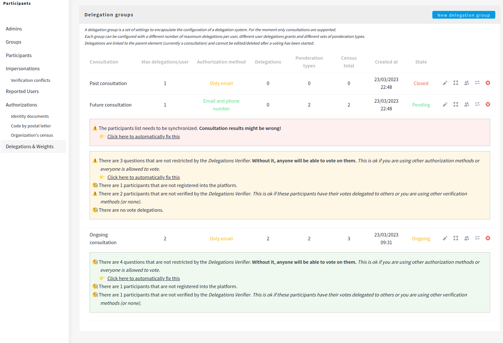

# Decidim::ActionDelegator

[![[CI] Lint](https://github.com/coopdevs/decidim-module-action_delegator/actions/workflows/lint.yml/badge.svg)](https://github.com/coopdevs/decidim-module-action_delegator/actions/workflows/lint.yml)
[![[CI] Test](https://github.com/coopdevs/decidim-module-action_delegator/actions/workflows/test.yml/badge.svg)](https://github.com/coopdevs/decidim-module-action_delegator/actions/workflows/test.yml)
[](https://codeclimate.com/github/coopdevs/decidim-module-action_delegator/maintainability)
[](https://codecov.io/gh/coopdevs/decidim-module-action_delegator)
[](https://badge.fury.io/rb/decidim-action_delegator)

A tool for Decidim that provides extended functionalities for cooperatives or any other type of organization that need to vote with weighted-vote results and/or vote-delegation.

Combines a CSV-like verification method with impersonation capabilities that allow users to delegate some actions to others.

Admin can set limits to the number of delegation per users an other characteristics.

Initially, only votes on consultations can be delegated.

## Dependencies

* [decidim-consultations](https://github.com/decidim/decidim/tree/master/decidim-consultations) >= v0.26.0
* [decidim-admin](https://github.com/decidim/decidim/tree/master/decidim-admin) >= v0.26.0
* [decidim-core](https://github.com/decidim/decidim/tree/master/decidim-core) >= v0.26.0

## Installation

Add this line to your application's Gemfile:

```ruby
gem "decidim-action_delegator"
```

Or, if you want to stay up to date with the latest changes use this line instead:

```ruby
gem 'decidim-action_delegator', git: "https://github.com/coopdevs/decidim-module-action_delegator"
```

And then execute:

```bash
bundle
bundle exec rails decidim_action_delegator:install:migrations
bundle exec rails db:migrate
```

> **IMPORTANT:** 
>
> If you are upgrading from a previous version, you need to run the migrations again and import all membership types/weights into the built-in census by executing in your production server:
>
> ```bash
> RAILS_ENV=production bundle exec rails decidim_action_delegator:import_direct_verifications
> ```
>
> *It is safe to run the previous command multiple times, no content will be imported twice.*


Depending on your Decidim version, you can choose the corresponding version to ensure compatibility:

| Version | Compatible Decidim versions |
|---|---|
| 0.7.x | 0.26.x |
| 0.6.x | 0.26.x |
| 0.5 | 0.25.x |
| 0.4 | 0.24.x |
| 0.3 | 0.24.x |
| 0.2 | 0.23.x |
| 0.1 | 0.22.0 |

*Heads up!*  [Consultations module will be deprecated in the near future.](https://github.com/decidim/decidim/issues/7097)

## Usage

ActionDelegator does not provides new Components or Participatory Spaces but enhances some functionalities in them.

Currently it is designed to work with the Consultations module.

- On one side, provides a custom verification method that allows admins to ensure only those in specific census (that can be uploaded via CSV) are able to vote. This census can be different for each consultation. This is optional and doesn't affect weighted voting or delegations.

- On the other, each set of census can work with a different set of weights and delegation.



### Extended consultation results

This gem modifies the consultation's results page adding two extra columns
`Membership type` and `Membership weight`. This is based on the census uploaded for each consultation and the weights assigned to each participant.

### Authorization verfifier and SMS gateway setup

The integrated authorization method is called "Delegations verifier". If included in each question of a consultation, it will check if the user is authorized and present in the census before letting him vote.

It can be used in 3 modes:

1. **Email only**: This means that the participants list for each consultation setting relies on the email only. No SMS gateway integration is needed. The user is verified if the email is found in the census.
2. **Email and phone**: This means that the participants list for each consultation setting relies on the email and the phone number. An SMS gateway integration is needed. The user is verified if the email is found in the census and then sending a verification code to the phone number that the user cannot edit.
3. **Phone only**: This means that the participants list for each consultation setting relies on the phone number only. An SMS gateway integration is needed. The user is verified by a form where a phone number must be introduced. The user can edit the phone number and the verification code is sent to the new phone number if that phone number is found in the participant's list. This method is useful to avoid to relay on keeping track of email changes for user's database.


In order to use this new sms gateway you need to configure your application. It can work on two modes,

The first is to use the same built-in SMS gateway used in Decidim: In `config/initializers/decidim.rb` set:

```ruby
config.sms_gateway_service = 'Decidim::ActionDelegator::SmsGateway'
```

> Note that if you use this method you will be able to use the built-in SMS verification method in Decidim.

The other is to use a gateway service specific only for this plugin, this allows you to separate gateways or prevent decidim to allow admins to use the built in SMS verification method. This comes preinstalled and only requires you to setup some ENV variables.

#### Som Connexió

You can use Som Connexió as SMS provider which uses [this SOAP API](https://websms.masmovil.com/api_php/smsvirtual.wsdl). Reach out to Som Connexió to sign up first.

Then you'll need to set the following ENV vars:

```bash
SMS_USER= # Username provided by Som Connexió
SMS_PASS= # Password provided by Som Connexió
SMS_SENDER= # (optional) Name or phone number used as sender of the SMS
```

#### Twilio

Alternatively, you can use Twilio as provider by specifying the folowing ENV vars

```bash
TWILIO_ACCOUNT_SID # SID from your Twilio account
TWILIO_AUTH_TOKEN # Token from your Twilio account
SMS_SENDER # Twilio's phone number. You need to purchase one there with SMS capability.
```

#### Custom SMS gateways

It is also possible to use your own Sms Gateway. In an new initializer (ie `config/initializers/action_delegator.rb`) set:

```ruby
Decidim::ActionDelegator.configure do |config|
  config.sms_gateway_service = 'YourOwnSmsGateway'
end
```

### Track delegated votes and unvotes

Votes and revocations done on behalf of other members are tracked through the
`versions` table using `PaperTrail`. This enables fetching a log of actions
involving a particular delegation or consultation for auditing purposes. This
keeps out regular votes and unvotes.

When performing votes and unvotes of delegations you'll see things like the
following in your `versions` table:

```sql
  id  |          item_type           | item_id |  event  | whodunnit | decidim_action_delegator_delegation_id 
------+------------------------------+---------+---------+-----------+----------------------------------------
 2019 | Decidim::Consultations::Vote |     143 | destroy | 1         |                                     22
 2018 | Decidim::Consultations::Vote |     143 | create  | 1         |                                     22
 2017 | Decidim::Consultations::Vote |     142 | create  | 1         |                                     23
 2016 | Decidim::Consultations::Vote |     138 | destroy | 1         |                                     23
```

Note that the `item_type` is `Decidim::Consultations::Vote` and `whoddunit`
refers to a `Decidim::User` record. This enables joining `versions` and
`decidim_users` tables although this doesn't follow Decidim's convention of
using gids, such as `gid://decidim/Decidim::User/1`.

You can use `Decidim::ActionDelegato::DelegatedVotesVersions` query object for
that matter.

## Contributing

Bug reports and pull requests are welcome on GitHub at https://github.com/coopdevs/decidim-module-action_delegator.

### Developing

To start contributing to this project, first:

- Install the basic dependencies (such as Ruby and PostgreSQL)
- Clone this repository

Decidim's main repository also provides a Docker configuration file if you
prefer to use Docker instead of installing the dependencies locally on your
machine.

You can create the development app by running the following commands after
cloning this project:

```bash
bundle
DATABASE_USERNAME=<username> DATABASE_PASSWORD=<password> bundle exec rake development_app
```

Note that the database user has to have rights to create and drop a database in
order to create the dummy test app database.

Then to test how the module works in Decidim, start the development server:

```bash
DATABASE_USERNAME=<username> DATABASE_PASSWORD=<password> bin/rails s
```

Note that `bin/rails` is a convenient wrapper around the command `cd development_app; bundle exec rails`.

In case you are using [rbenv](https://github.com/rbenv/rbenv) and have the
[rbenv-vars](https://github.com/rbenv/rbenv-vars) plugin installed for it, you
can add the environment variables to the root directory of the project in a file
named `.rbenv-vars`. If these are defined for the environment, you can omit
defining these in the commands shown above.

#### Webpacker notes

As latests versions of Decidim, this repository uses Webpacker for Rails. This means that compilation
of assets is required everytime a Javascript or CSS file is modified. Usually, this happens
automatically, but in some cases (specially when actively changes that type of files) you want to 
speed up the process. 

To do that, start in a separate terminal than the one with `bin/rails s`, and BEFORE it, the following command:

```bash
bin/webpack-dev-server
```

#### Code Styling

Please follow the code styling defined by the different linters that ensure we
are all talking with the same language collaborating on the same project. This
project is set to follow the same rules that Decidim itself follows.

[Rubocop](https://rubocop.readthedocs.io/) linter is used for the Ruby language.

You can run the code styling checks by running the following commands from the
console:

```bash
bundle exec rubocop
```

To ease up following the style guide, you should install the plugin to your
favorite editor, such as:

- Sublime Text - [Sublime RuboCop](https://github.com/pderichs/sublime_rubocop)
- Visual Studio Code - [Rubocop for Visual Studio Code](https://github.com/misogi/vscode-ruby-rubocop)

#### Non-Ruby Code Styling

There are other linters for Javascript and CSS. These run using NPM packages. You can
run the following commands:

1. `npm run lint`: Runs the linter for Javascript files.
2. `npm run lint-fix`: Automatically fix issues for Javascript files (if possible).
3. `npm run stylelint`: Runs the linter for SCSS files.
4. `npm run stylelint-fix`: Automatically fix issues for SCSS files (if possible).

### Testing

To run the tests run the following in the gem development path:

```bash
bundle
DATABASE_USERNAME=<username> DATABASE_PASSWORD=<password> bundle exec rake test_app
DATABASE_USERNAME=<username> DATABASE_PASSWORD=<password> bundle exec rspec
```

Note that the database user has to have rights to create and drop a database in
order to create the dummy test app database.

In case you are using [rbenv](https://github.com/rbenv/rbenv) and have the
[rbenv-vars](https://github.com/rbenv/rbenv-vars) plugin installed for it, you
can add these environment variables to the root directory of the project in a
file named `.rbenv-vars`. In this case, you can omit defining these in the
commands shown above.

### Test code coverage

Running tests automatically generates a code coverage report. To generate the complete report run all the tests using this command:

```bash
bundle exec rspec
```

This will generate a folder named `coverage` in the project root which contains
the code coverage report.

### Localization

If you would like to see this module in your own language, you can help with its
translation at Crowdin:

https://crowdin.com/project/decidim-action-delegator-vote

## License

This engine is distributed under the GNU AFFERO GENERAL PUBLIC LICENSE.
